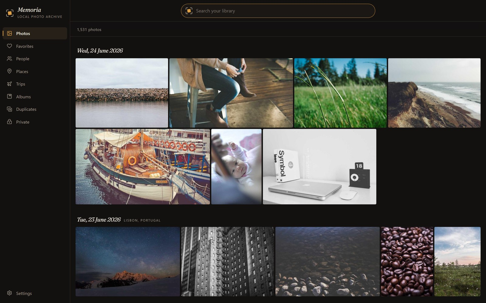
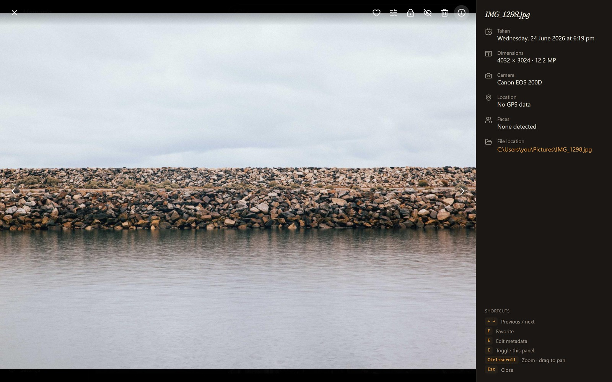
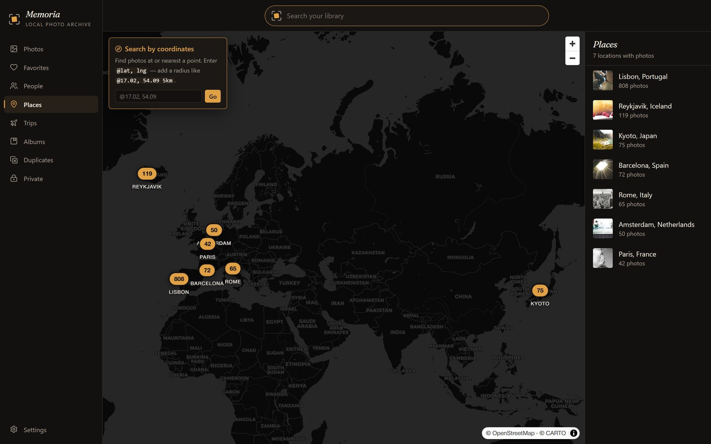
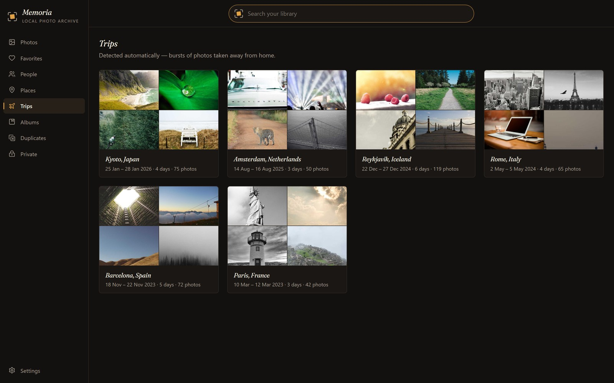
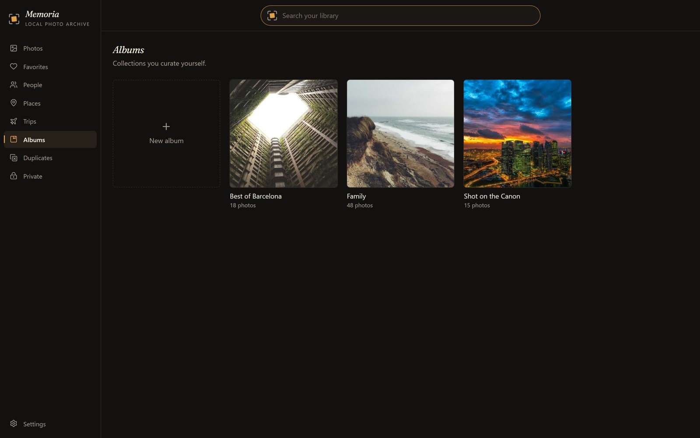
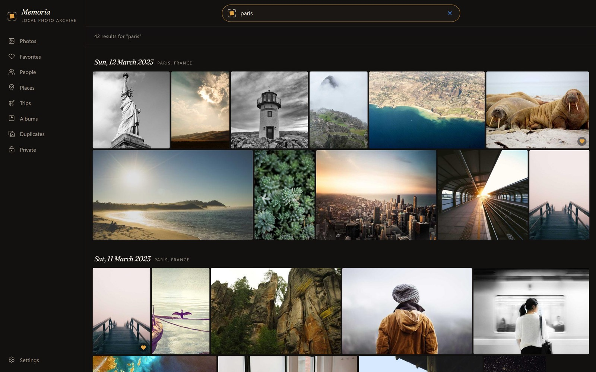

# Memoria

*Your photos, on your machine.*

A local-first photo & video manager for Windows — like Google Photos, but
**nothing ever leaves your computer.** Memoria indexes the photo folders you
already have (including external drives) and gives you a timeline, albums, a map,
auto-detected trips, duplicate detection, face grouping and "beach sunset"
search — all running offline on your own PC.

Your original photos are only ever **read**. Never modified, never moved, never
permanently deleted.



---

## Before you start

You need three things:

| | What | Notes |
|---|---|---|
| 1 | **Windows 10 or 11** | WebView2 is already built into Windows 11 — nothing to install |
| 2 | **[Python 3.12](https://www.python.org/downloads/)** | ⚠️ During installation you **must tick "Add python.exe to PATH"** on the very first screen |
| 3 | **An internet connection** | Only for the one-time setup. After that Memoria works completely offline |

**Python is the only prerequisite.** You do *not* need Visual Studio, C++ build
tools, or any other developer software.

> **Not sure if you have Python?** Press `Win + R`, type `cmd`, press Enter, then
> type `python --version`. If you see a version number like `Python 3.12.x`,
> you're set. If you see an error, install it from the link above.

---

## Step 1 — Download Memoria

Go to the project page: **https://github.com/anvony/Memoria**

### Option A — Download the ZIP (easiest, no extra software)

1. Click the green **`< > Code`** button near the top right.
2. Click **Download ZIP**. You'll get a file called `Memoria-main.zip`.
3. **Important — unblock it first.** Windows marks files downloaded from the
   internet as blocked, which will stop the setup script from running:
   - Right-click `Memoria-main.zip` → **Properties**
   - At the bottom, tick **Unblock** → click **OK**
4. Right-click the ZIP → **Extract All…** → choose where to put it (see Step 2).

### Option B — Use Git (if you have it)

```
git clone https://github.com/anvony/Memoria.git
```

---

## Step 2 — Put the folder somewhere permanent

Move the extracted folder (it'll be called `Memoria-main`, and you can rename it
to just `Memoria`) to a **permanent location** — this is where the app will live
from now on.

**Good places:**
- `C:\Memoria`
- `D:\Memoria`
- `C:\Users\YourName\Apps\Memoria`

**Avoid:**
- ❌ Your **Downloads** folder (you'll clear it out one day and delete the app)
- ❌ Inside a **OneDrive-synced** folder (Desktop and Documents often are on
  Windows 11) — OneDrive tries to sync thousands of engine files and can lock
  them mid-use

> **Why it matters:** `Memoria.exe` and the `server` folder next to it are a
> pair. The app looks for its engine in the `server` folder sitting beside it.
> If you move one without the other, or move the folder after setup, Memoria
> can't start its engine. If you *do* need to move it later, move the **whole
> folder** and run `setup.cmd` again.

---

## Step 3 — Run `setup.cmd` (once)

Double-click **`setup.cmd`** inside the folder.

This is the one-time step that builds Memoria's photo engine on your PC. It:

- creates Memoria's private Python environment,
- downloads the video tools it needs (ffmpeg),
- and puts a **Memoria** shortcut on your Desktop and in the Start Menu.

A black console window opens with a progress bar:

```
============================================================
   Memoria - one-time setup
============================================================

  Setting up Memoria. This takes a few minutes.
  Please don't close this window.

  [###########.........]  55%  Installing core packages
```

It takes a few minutes. **Leave it alone until it says "All set"**, then close it.

If anything goes wrong it tells you what failed and writes the details to
`setup-log.txt` in this folder.

> **If Windows shows a blue "Windows protected your PC" box:** click
> **More info → Run anyway**. This happens because the file came from the
> internet and isn't code-signed. (You can read exactly what it does — it's a
> plain text file you can open in Notepad.)

> **If it says "Python was not found":** Python either isn't installed, or was
> installed without ticking "Add python.exe to PATH". Reinstall it from
> [python.org](https://www.python.org/downloads/), tick that box, then run
> `setup.cmd` again.

---

## Step 4 — Open Memoria

Launch it from the **Desktop shortcut**, or double-click **`Memoria.exe`** in the
folder.

> **First launch:** Windows SmartScreen may say *"Windows protected your PC —
> unrecognized app"*. Click **More info → Run anyway**. This appears because the
> app isn't code-signed (a certificate costs money); it's not a warning that
> anything is wrong.

Then Memoria asks you two things:

**1. Where should Memoria keep its own data?**

This is Memoria's private workspace — its catalogue and thumbnail cache. Pick a
drive with some free space (a large library can use several GB of thumbnails).

⚠️ **This is not your photo folder.** It's a separate folder Memoria creates for
itself. It's also the only thing you'd ever need to back up.

**2. Which photo folders should it index?**

Open **Settings** → **Source folders** → add the folder(s) containing your
photos. You can paste a path or browse for it. External drives are fine.

Indexing then starts automatically in the background — you can browse while it
works. The first run on a big library takes a while (it's reading every photo);
after that, startup only checks for what's new, which is quick.

---

## Step 5 (optional) — Faces & semantic search

Face grouping ("who is in my photos") and semantic search ("beach sunset") are
**off by default**, and `setup.cmd` deliberately doesn't install them — that
keeps the base install small and fast.

To turn them on:

1. Open Memoria → **Settings**
2. Under **Faces & semantic search**, click **Turn on**
3. The first time only, Memoria downloads what it needs on demand
   (**~2–3 GB** of packages and AI models) with a progress bar. Leave it running.
4. When it finishes, run a **rescan** so people and search results appear.

Everything else — timeline, albums, map, trips, duplicates, HEIC and video
thumbnails — works fully without ever turning this on.

---

## A look around

**The viewer.** Click any photo. Arrow keys move through the day, `I` opens the
info panel (date, camera, dimensions, location, faces, and where the file lives
on disk), `F` favourites it, `Ctrl+scroll` zooms up to 6× with drag to pan.



**Places.** Every photo with GPS lands on the map, clustered by location — click
a cluster to see just those photos. Place names are worked out offline, with no
internet call.



**Trips.** Memoria works out where you live from your photos, then groups the
ones taken away from home into trips automatically. Nothing to tag.



**Albums** for the collections you make by hand — select photos in the grid and
add them in a couple of clicks.



**Search** understands places, people, cameras, years and months in one box —
try `paris 2023`. With semantic search on, plain-English description search
("beach sunset") and `@lat,lng` coordinate lookup run through the same box.



> The screenshots above use Memoria's built-in demo library, so the photos in
> them are stock images. The app is the real thing — point it at your own folders
> and it's your photos in exactly this layout.

---

## Everyday use

- **Your originals are safe.** Memoria never edits, moves, or permanently
  deletes your files. Deletes go to the **Recycle Bin**. Metadata edits live only
  in Memoria's own catalogue, unless you explicitly opt in to writing originals.
- **Everything is offline.** No account, no cloud, no telemetry. The only network
  use is the one-time setup and the optional AI model download.
- **Leave it indexing.** It's incremental — if you close the app mid-index, it
  picks up where it left off next time.
- **Unplugged an external drive?** Those photos stay browsable from cached
  thumbnails and are marked offline. Plug it back in and they come straight
  back — even if Windows gave it a different drive letter.

---

## Troubleshooting

### "It's showing photos that aren't mine"

You're seeing Memoria's **demo library** (generic stock photos). This means the
app started but couldn't find its engine, so it fell back to demo mode.

Almost always one of these:

1. **`setup.cmd` hasn't been run yet** in this folder → run it (Step 3).
2. **The folder was moved after setup** → run `setup.cmd` again in the new
   location.
3. **`Memoria.exe` got separated from the `server` folder** → they must sit side
   by side in the same folder.

### "Windows protected your PC"

Expected — the app isn't code-signed. **More info → Run anyway.** If you're
cautious, the whole engine is readable Python source in the `server` folder.

### Setup fails partway through

The window tells you which step failed and what went wrong. The usual causes are
no internet connection, or antivirus blocking the ffmpeg download. Fix it and run
`setup.cmd` again — it's safe to re-run and skips whatever already succeeded.

The full details are in **`setup-log.txt`** next to `setup.cmd` — that's the file
to send if you need help. To watch every command as it runs instead of the
progress bar, open a Command Prompt in this folder and run `setup.cmd -ShowOutput`.

### Videos have no thumbnails

ffmpeg didn't download during setup. Re-run `setup.cmd` with an internet
connection.

### The app opens but stays empty

Check **Settings → Source folders** — you may not have added a photo folder yet.
If one is listed but shows as offline, the drive isn't connected.

---

## Updating to a new version

1. Download the new version (Step 1).
2. Extract it to a **new** folder.
3. Run `setup.cmd` in the new folder.
4. Point it at the **same data folder** you chose originally.

Your library, albums, favourites, names and edits all live in that data folder,
so they carry across untouched. Once the new version works, you can delete the
old folder.

---

## Uninstall

Memoria isn't "installed" into Windows — it lives entirely in its own folder.
To remove it completely:

1. Delete the Memoria folder.
2. Delete the shortcuts (Desktop + Start Menu).
3. Optionally delete Memoria's data folder (the one you chose at first launch)
   and `%LOCALAPPDATA%\Memoria`.

**Your photos are untouched by all of this** — Memoria only ever read them.
